<div align="center">

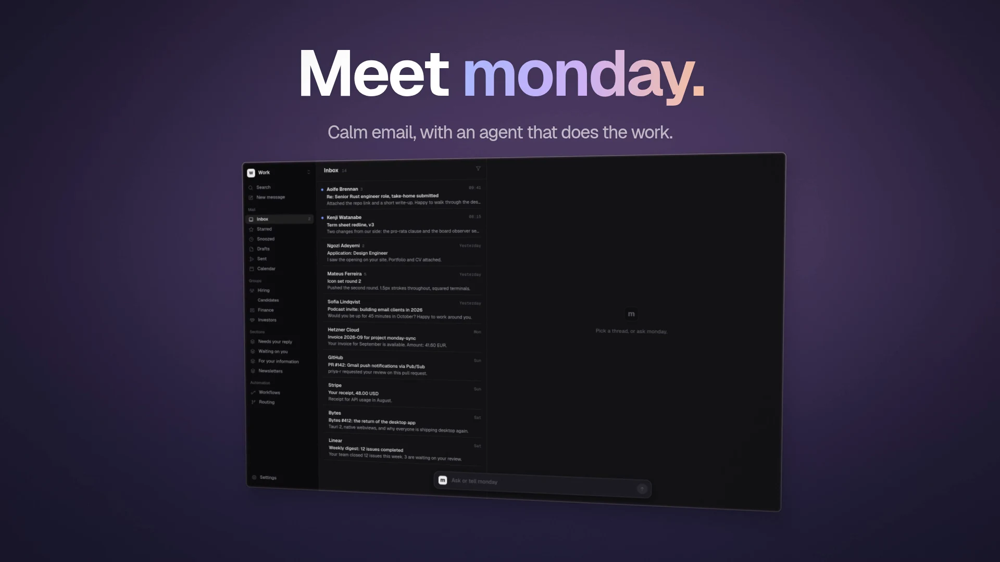

<h1>monday</h1>

<p><strong>Calm email, with an agent that does the work.</strong></p>

<p>An open-source, agent-first email client for Linux, macOS and Windows,<br>with a self-hosted sync server you own. One person, every mail account, no telemetry.</p>

<p>
  <a href="LICENSE"></a>
  
  <a href="https://v2.tauri.app"></a>
  <a href="https://bun.sh"></a>
  
  
  
</p>

<p>
  <a href="#a-tour">Tour</a> ·
  <a href="#principles">Principles</a> ·
  <a href="#how-it-fits-together">Architecture</a> ·
  <a href="#build-it-from-source">Build from source</a> ·
  <a href="docs/spec/README.md">Spec</a> ·
  <a href="docs/adr/">Decisions</a> ·
  <a href="#contributing">Contributing</a>
</p>

</div>

<br>

## Why monday

Email clients have spent twenty years adding buttons. monday takes most of them away and gives you one Agent instead: it can search, draft, send, archive, reroute, change any Setting and write automations, all from a sentence. The mail itself stays quiet. Threads sort themselves into Groups and Sections, every Thread worth reading opens with a short Brief, and search answers before you finish typing.

The Agent can do anything you can, with one rule it cannot break: **anything that leaves your mailbox asks you first.** Sends, forwards, deletes and messages to third parties stop at an Approval card with the exact outcome on it. Everything else applies at once and comes with Undo.

It runs on your machine. The desktop app starts a small sync server, the Sidecar, beside itself, with an embedded Postgres, and that is the whole install. If you want mail to sort itself and Workflows to keep running while your laptop is closed, deploy the same server to a container, Vercel or Netlify and point both at one Postgres.

> [!NOTE]
> monday is in active development and has no packaged release yet. Everything below runs from source. The screenshots come from the design mock in [`design/`](design/), which uses invented people and mail.

<br>

## A tour

### A sorted inbox, without rules to maintain

<picture>
  <source media="(prefers-color-scheme: dark)" srcset="docs/assets/readme/inbox-dark.webp">
  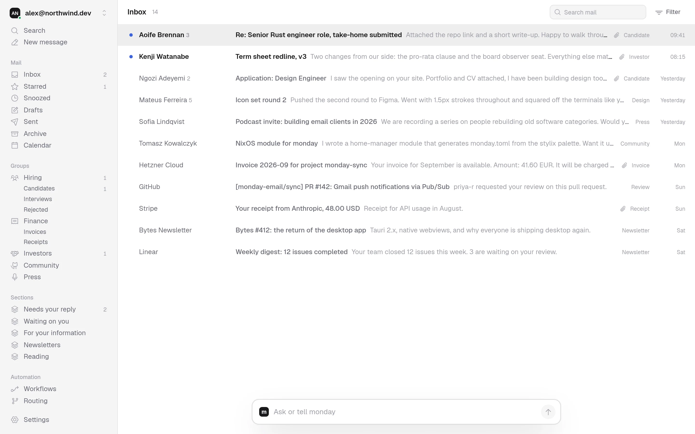
</picture>

Mail lands in one calm stream. In the nav, **Groups** (Hiring, Finance, Investors) are smart inboxes the Agent fills from a plain-language Routing rule, with **Sub-groups** one level down. **Sections** are the kinds of attention a Thread needs: *Needs your reply*, *Waiting on you*, *For your information*, *Newsletters*, plus any you describe yourself. A Group is a lens on the Inbox, never a move out of it, and a Thread the rules are unsure about waits in **Needs a decision** instead of being filed wrong.

Gmail, Microsoft 365, JMAP (Fastmail) and any IMAP/SMTP server. Many Accounts, each its own Workspace.

### Briefs and Recommended actions

<picture>
  <source media="(prefers-color-scheme: dark)" srcset="docs/assets/readme/brief-dark.webp">
  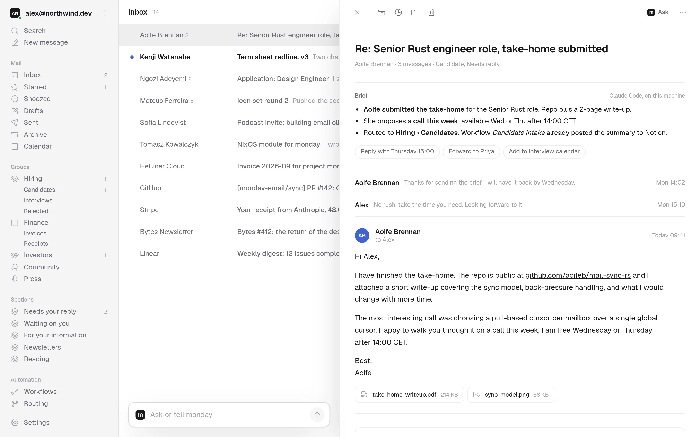
</picture>

Open a Thread and the **Brief** is already there: three lines on what happened, what is asked of you and where it went. Under it sit **Recommended actions** with their arguments already chosen, such as *Reply with Thursday 15:00* or *Forward to Priya*. Each is an ordinary tool call with its Tier, so a reply still asks before it sends. Briefs are written only for Threads worth one, by a policy you can read and change in a sentence.

### An Agent that asks first

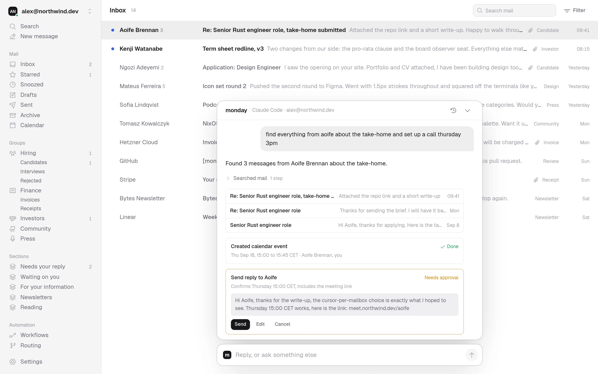

Type into the bar at the bottom of every screen: *"find everything from Aoife about the take-home and set up a call Thursday 3pm."* The Agent searches, creates the Event, drafts the reply in your voice, and stops. The send waits on an Approval card with the full message, and nothing goes out until you press **Send**. Every Tool call lands in the **Activity log** with who approved it and how to undo it.

Bring your own model. A **Local runtime** drives the CLI agent you already use (Claude Code, Codex or OpenCode) with its own shell and file tools stripped, so mail content can never reach them. A **Hosted runtime** uses your key for Anthropic, Gemini, OpenAI, Kimi or OpenRouter and keeps working while your devices are off, with every call and its estimated cost on the **Meter**. Typed decisions (which Group, which Section, is a Brief worth writing) are Judgments answered with probabilities, by [TypeSafe](https://docs.typesafe.ai) when you add its key and by your language model otherwise.

### Change the app by asking

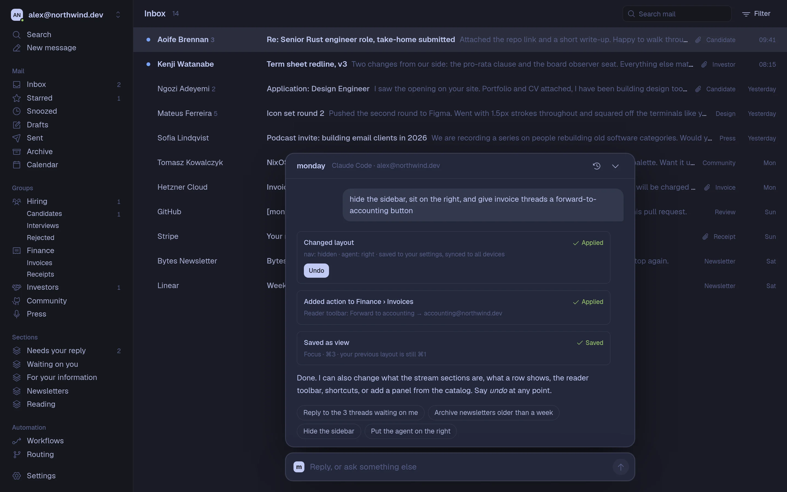

Every behavior in monday is a Setting, and the Agent can change any of them. Move it to the right, hide the sidebar, switch to Gruvbox, add a *Forward to accounting* button to every Thread in Finance › Invoices: each change shows what it did, applies at once, and has Undo.

<picture>
  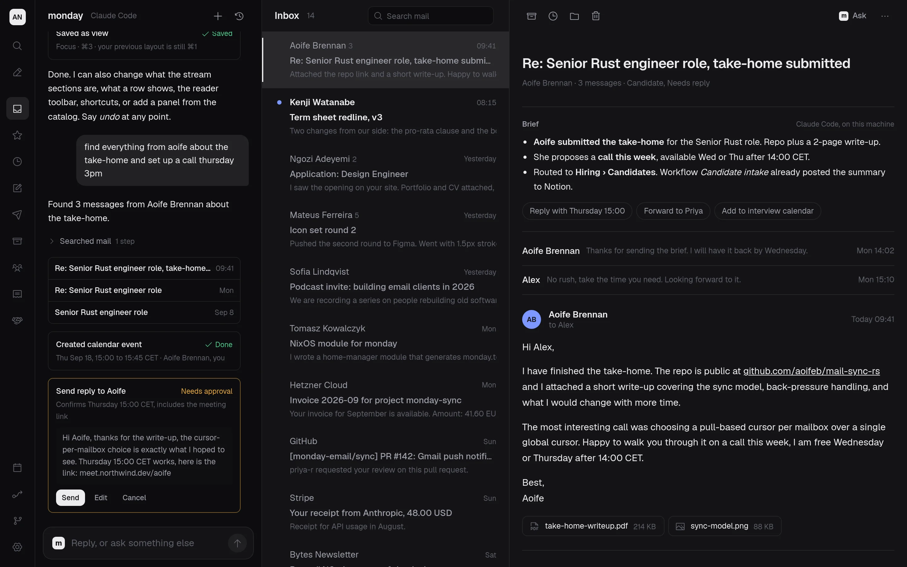
</picture>

Three Presets (Stream, Columns, Agent left) and three knobs underneath them: nav (full, rail, hidden), agent (bottom, left, right) and list (stream, split). Save any Layout under a shortcut and flip between them with <kbd>⌘1</kbd> <kbd>⌘2</kbd> <kbd>⌘3</kbd>.

### Workflows, written from a sentence

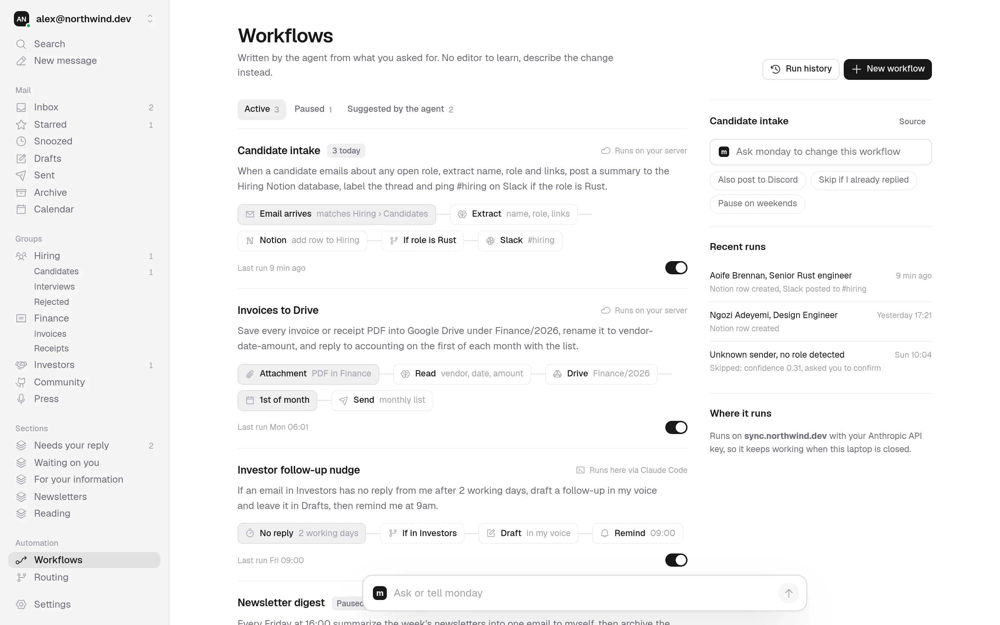

Describe an automation and the Agent writes the **Workflow**: a Trigger (a Thread arriving, an attachment, a schedule, silence after N days, a Tag, a calendar Event) and a chain of Steps, some of which may call the model under a Budget. Before you turn one on, a **Dry run** over your recent mail shows exactly what it would have done. Steps that send or post still ask, unless you grant that one Step a **Standing approval**, which stays visible and revocable on the page. Workflows run on the Server with a Hosted runtime, or on your Local runtime while the app is open.

### Routing you can read

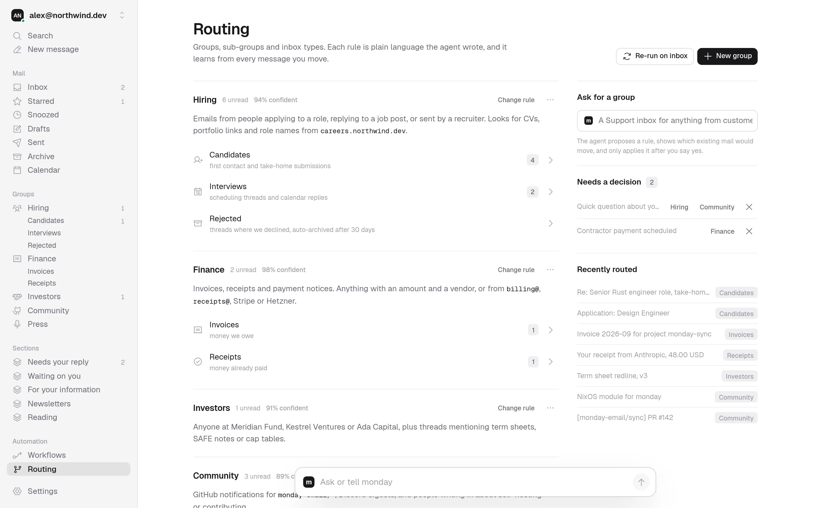

Every Group's rule is a sentence the Agent wrote and you can edit. Each rule gives a Thread a Confidence: above the threshold it is placed, in the ask band it goes to Needs a decision, below it is left alone. Every Thread you move becomes an Example the rule learns from. Ask for a new Group and the Agent shows which existing mail would move before anything does.

### Views: pages you ask for

Ask for a page in a sentence, *"all my Amazon orders with shipped and delivered lanes and total spend per month"* or *"invoices I owe as a table with amount, due date and vendor"*, and the Agent writes a **View**: a scope of Threads, the Fields to read from each, and a stack of Blocks from a fixed catalog (lanes, table, chart, stat, calendar, timeline, cards and more). Values are picked from the mail's own text by selection, never invented, and code does every sum and count. A View is tried on your real mail before you pin it, then lives in the nav and updates live.

### Templates that fill themselves in

Reusable Messages with typed Placeholders like `{name}` and `{amount}`. monday fills a Placeholder only by picking a span from the Thread you are answering, never by making a value up, and blocks Send while one is still empty. Start a Message from one, answer with one, or let the composer suggest one while you type.

### Instant search and the command palette

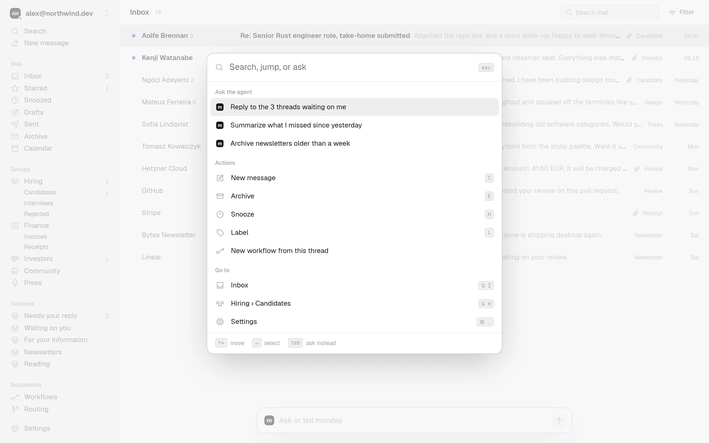

Search runs on a local full-text index with Gmail-style operators (`from:`, `to:`, `has:attachment`, `in:`, `tag:`, dates) and never waits on the network or a model. Mail older than the local index is one explicit *Search older mail* away. The same input is the command palette: jump anywhere, run any action, or hand the sentence to the Agent with <kbd>Tab</kbd>.

### Compose, calendar and the rest of a mail client

<table>
  <tr>
    <td width="50%">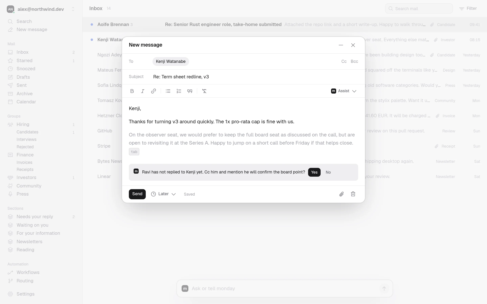</td>
    <td width="50%">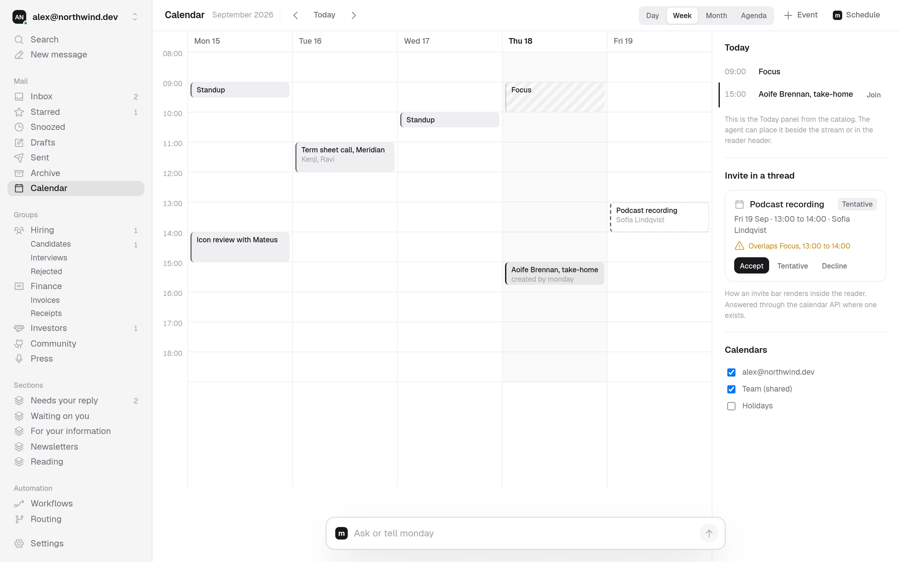</td>
  </tr>
  <tr>
    <td>Rich text with a plain-text alternative, drafts saved to the Server and mirrored to your Provider, <b>Send later</b>, and every send held for 30 seconds so <b>Undo</b> really works.</td>
    <td>Day, Week, Month and Agenda over Google, Microsoft and CalDAV calendars, Invites answered from the reader, and meeting times offered from your real Free slots.</td>
  </tr>
</table>

Snooze, star, Labels both ways, monday's own Tags, three keymaps (vim, Gmail, natural), offline actions that replay from the Outbox on reconnect, and an external MCP server so other agents can use monday's tools with the same Approvals.

### Seven palettes, light and dark, or your own

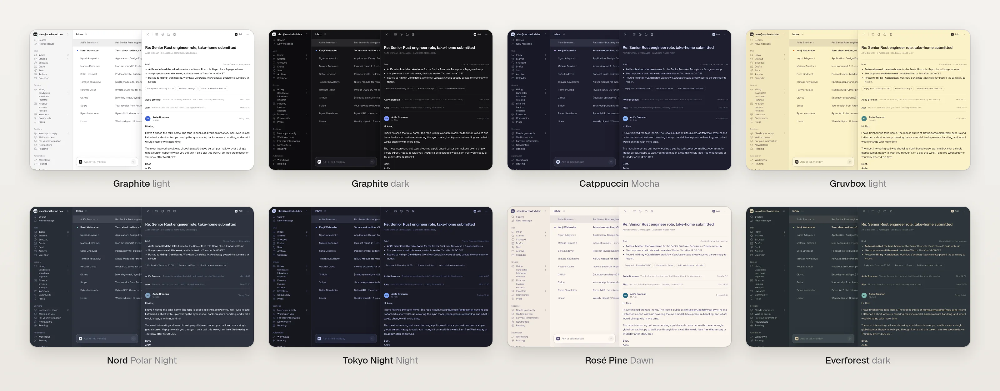

Graphite, Catppuccin, Gruvbox, Nord, Tokyo Night, Rosé Pine and Everforest, each with a light and a dark half, plus your own palette file in token TOML or base16 YAML. Three Densities, your choice of font, and Phosphor icons throughout.

### You choose how much AI

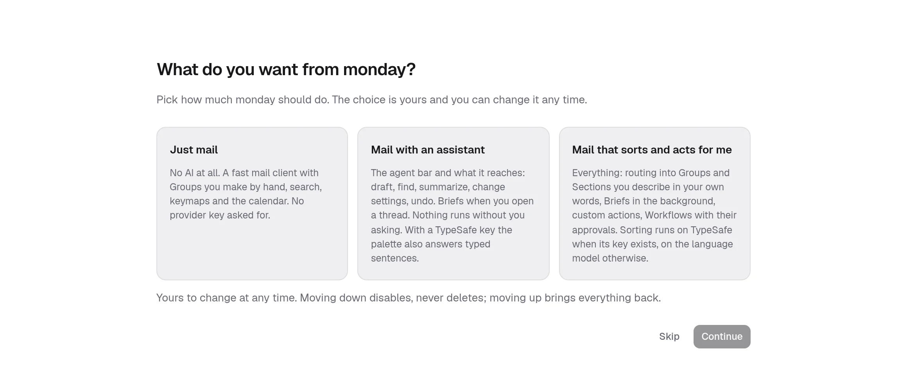

The first screen asks how much AI you want. **Just mail** is a fast client with no model calls at all. **Mail with an assistant** adds the Agent bar and Briefs on open, and nothing runs unasked. **Mail that sorts and acts for me** adds routing, background Briefs and Workflows. Change it any time: moving down disables, never deletes.

### A config file that is yours

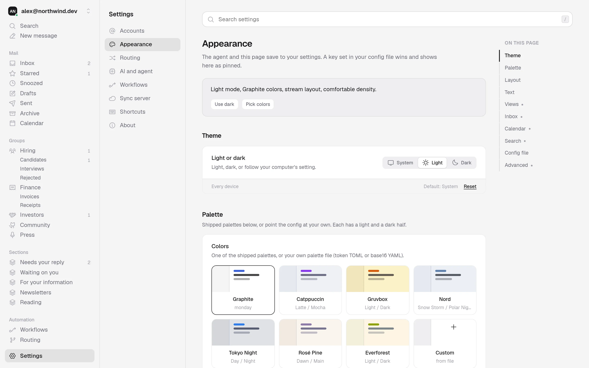

Every Setting has a default in one schema, and every Settings page is drawn from it, so nothing is hidden behind a hard-coded constant. For dotfiles and rices, `monday.toml` sits in `~/.config/monday/` (or your platform's config directory), reloads live, and always wins: a key set in the file shows as Pinned in the UI. The app never writes the file unless you ask it to.

```toml
# ~/.config/monday/monday.toml
[appearance]
mode    = "dark"         # light | dark | system
palette = "gruvbox"      # or a path to your own palette file
density = "compact"      # compact | comfortable | spacious

[layout]
nav   = "rail"           # full | rail | hidden
agent = "right"          # bottom | left | right

[ai]
level = "assist"         # off | assist | automate
```

<br>

## Principles

- **Local first.** The app reads from a local Cache, so the list, the reader and search never wait on the network. Offline actions queue in the Outbox and replay in order.
- **Nothing leaves without your yes.** Approvals live inside the tools, not in the prompt, so no model, Workflow or external agent can talk its way past them ([ADR 0002](docs/adr/0002-approvals-live-in-the-tools.md)).
- **Every behavior is a Setting.** Product behavior has a default in the schema and is never a constant, and the Agent can change any of it ([ADR 0004](docs/adr/0004-behaviors-are-settings-the-agent-can-change.md)).
- **The config file is yours.** It wins over saved Settings and the app never writes it unasked ([ADR 0001](docs/adr/0001-config-file-wins-and-the-app-never-writes-it.md)).
- **Your mail is encrypted at rest.** Bodies and everything derived from them are stored under envelope encryption with a root key only you hold, kept in your keychain with a recovery file you export.
- **Search never waits.** Every keystroke is answered from the local index ([ADR 0011](docs/adr/0011-search-is-local-and-never-waits.md)).
- **No telemetry.** monday sends nothing home.

<br>

## How it fits together

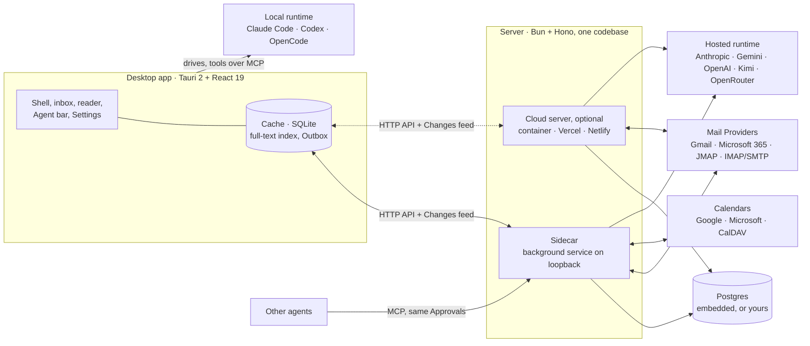

- **The desktop app** keeps a per-Workspace SQLite Cache with headers for every Thread, bodies for recent and opened ones, and a full-text index. It reads the ordered Changes feed from a cursor and writes intents through the Outbox.
- **The Sidecar** is the Server bundled with the app. It runs as a background service that outlives the window, so mail keeps syncing and notifications still arrive after you close monday ([ADR 0013](docs/adr/0013-the-sidecar-is-a-background-service.md)). Alone, it starts an embedded Postgres and does everything.
- **A Cloud server** is the same code deployed to a container, Vercel or Netlify. Servers never talk to each other: they share one Postgres and coordinate through a jobs table with leases and heartbeats ([ADR 0005](docs/adr/0005-one-postgres-two-workers-and-a-jobs-table.md)).
- **Sending is a scheduled Job**, which is what makes Undo send, Send later and sending from a closed laptop the same feature ([ADR 0010](docs/adr/0010-send-is-a-scheduled-job.md)).

The full picture, with the data model and API shape, is in [`docs/spec/architecture.md`](docs/spec/architecture.md).

<br>

## Build it from source

### Prerequisites

- [Bun](https://bun.sh) 1.x
- A Rust toolchain and the [Tauri 2 system dependencies](https://v2.tauri.app/start/prerequisites/) for your platform. On Linux, `nix-shell` with the repo's [`shell.nix`](shell.nix) provides all of it, WebKitGTK included.

### Run it

```sh
git clone https://github.com/dopeCape/monday.git
cd monday
bun install

nix-shell              # Linux with Nix: Rust, WebKitGTK and the rest
bun run tauri dev      # builds the Sidecar, then starts the desktop app
```

`bun run tauri` stages the Sidecar first (`bun run stage` compiles the server and copies Postgres and the migrations next to the app), then hands over to the Tauri CLI. Closing the window leaves the Sidecar running in the background; [`docs/dev/sidecar.md`](docs/dev/sidecar.md) covers how to stop, restart and rebuild it.

### Other scripts

| Command | What it does |
|---|---|
| `bun run dev` | The desktop frontend alone on Vite |
| `bun run server` | The Server in watch mode (`apps/server/entry/bun.ts`) |
| `bun run design` | Serves the static design mock in `design/` |
| `bun run stage` | Compiles the Server and stages it as the Tauri sidecar |
| `bun test` | Every test in the repo |
| `bun run typecheck` | TypeScript across every workspace |
| `bun run lint` | Biome checks |
| `bun run format` | Biome formatting |

### Repository layout

```
apps/
  desktop/        Tauri 2 app, React 19. src-tauri/ is Rust: the Sidecar service,
                  keychain, config watcher and SQLite commands.
  server/         Bun + Hono. src/app.ts is a runtime-neutral fetch handler;
                  Bun-only APIs live under entry/ (bun, vercel, netlify).
packages/
  shared/         Domain types, the settings schema, the Workflow schema, the
                  config file parser, API client types. No Bun or DOM.
  ui/             Tokens, CSS and components.
design/           The static design mock: the visual reference.
docs/
  spec/           The v1 build spec, behavior by behavior.
  adr/            Architecture decisions, one page each.
  dev/            Developer notes.
CONTEXT.md        The glossary. Every term above is defined there.
```

<br>

## Documentation

| Read | For |
|---|---|
| [`CONTEXT.md`](CONTEXT.md) | The glossary: Thread, Section, Group, Brief, Signal, View, Workflow, Sidecar and the rest |
| [`docs/spec/README.md`](docs/spec/README.md) | The spec index: what decides what, and where |
| [`docs/adr/`](docs/adr/) | Sixteen architecture decisions, one page each |
| [`docs/spec/architecture.md`](docs/spec/architecture.md) | Modules, deployment modes, data model, API |
| [`inbox`](docs/spec/inbox.md) · [`agent-composer`](docs/spec/agent-composer.md) · [`routing`](docs/spec/routing.md) · [`workflows`](docs/spec/workflows.md) · [`views`](docs/spec/views.md) · [`templates`](docs/spec/templates.md) · [`calendar`](docs/spec/calendar.md) · [`settings`](docs/spec/settings.md) | Behavior specs a tester can check |
| [`docs/spec/slices.md`](docs/spec/slices.md) | The ordered implementation plan |
| [`design/README.md`](design/README.md) | The design mock and its knobs |

<br>

## Contributing

Issues and pull requests are welcome. Before you start:

1. Read [`docs/spec/README.md`](docs/spec/README.md) and use the glossary's terms exactly, in code and in prose.
2. A new product behavior is a Setting with a default in the schema, never a constant.
3. Anything that leaves the mailbox asks first, and the asking lives inside the tool.
4. No Tailwind, component libraries or CSS-in-JS. Styling is monday's own CSS tokens; the Agent composer uses Assistant UI's headless primitives. Phosphor icons only.
5. Test each module through its interface with fakes at the seam, and make sure `bun test` and `bun run typecheck` pass.

<br>

## License

[MIT](LICENSE). Free, and yours to run.

<div align="center">
<br>
<sub>A Monday you'll look forward to.</sub>
</div>
